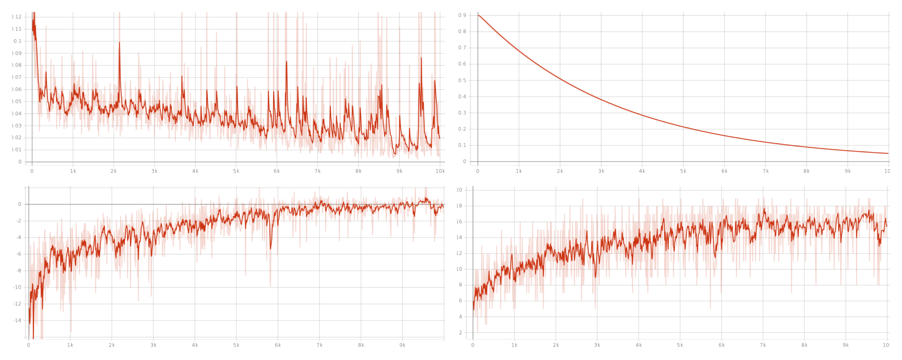

# Graph Exploration with Deep Reinforcement Learning
----

This project addresses the problem of efficiently exploring unseen environments. The aim is to build a framework where an agent can learn to explore a graph, visiting the maximum number of states in a limited number of steps. 
This has been done (at least tried) with the combination of Deep Reinforcement Learning and Geometric Deep Learning. The environments considered in this project are small **5x5 grid graphs with a few obstacles** like this one:

<div style="text-align:center"></div>

## Training

An agent has been equipped with two Graph Neural Networks[[1]] in order to implement the DQN (and DDQN) algorithm. The training has been done on 1 graph and the results below have been drawn from the test-set of 9 unseen graphs.
The two (identically structure) GNNs are coded ([here](model.py)) as sequential models built on top of the Gated Graph Sequence Neural Network [[2]], as implemented here [[3]]. You can find a more detailed analyis in my [report](report.pdf).


My training went throug 10000 episodes of 25 steps each, where an exponentially-decaying epsilon-greedy strategy selected the actions for the agent. You can load my training notebook [here](train.ipynb), beware that the code is quite messy. 

<div style="text-align:center"></div>

In the plots above a few metrics where registered.

1. Top left = Loss
2. Top right = Epsilon decay
3. Bottom left = Reward
4. Bottom right = Nodes visited


## Testing

Every environment was tested for 30 episodes of 25 steps each, where the agent could only use the action proposed by the previously trained network. At the end of every episode the percentage of valid nodes visited by the agent has been registered and the table below shows the results in term of mean, std and best episode coverage. The agent was trained on `maze_5x5_0`.

|      Map     | Mean |  Std | Best Run |
|:------------:|:----:|:----:|:--------:|
| `maze_5x5_0` | 89.8 | 8.3  |  100.0   |
| `maze_5x5_1` | 61.9 | 25.6 |   88.9   |
| `maze_5x5_2` | 78.5 | 10.7 |   94.4   |
| `maze_5x5_3` | 55.2 | 20.7 |   88.9   |
| `maze_5x5_4` | 74.0 | 9.5  |   89.5   |
| `maze_5x5_5` | 62.6 | 18.0 |   83.3   |
| `maze_5x5_6` | 71.4 | 19.1 |   88.2   |
| `maze_5x5_7` | 63.5 | 11.1 |   81.0   |
| `maze_5x5_8` | 56.0 | 23.9 |   85.0   |
| `maze_5x5_9` | 82.1 | 9.2  |   95.5   |

The results above have been obtained with `models/model_16_03_2020-122921.pt`.

The next table shows the results for a random policy, where the agent selects the next action by (uniformly) randomly samplig the action space (which is {left, up, right, down}).

|      Map     | Mean |  Std | Best Run |
|:------------:|:----:|:----:|:--------:|
| `maze_5x5_0` | 34.5 | 11.8 |   57.9   |
| `maze_5x5_1` | 32.2 | 11.2 |   55.6   |
| `maze_5x5_2` | 33.1 | 11.6 |   72.2   |
| `maze_5x5_3` | 31.1 | 10.0 |   50.0   |
| `maze_5x5_4` | 30.8 | 12.1 |   57.9   |
| `maze_5x5_5` | 32.2 | 8.7  |   55.6   |
| `maze_5x5_6` | 28.2 | 8.0  |   41.2   |
| `maze_5x5_7` | 36.9 | 12.8 |   57.1   |
| `maze_5x5_8` | 37.0 | 9.5  |   55.0   |
| `maze_5x5_9` | 36.1 | 10.8 |   54.5   |

The testing code can be found in the [testing notebook](test.ipynb). Beware that the code is quite **messy**! You may want to test locally with [`test.py`](test.py).

## Requirements
I've written the code directly into Google Colab, if you import the notebooks into Colab (Python3 + GPU) they should work out of the box.
The libraries used are
```
numpy
gym
networkx
torch >= 1.4.0
torch_geometric
tensorboard >= 2.0
matplotlib
```


[1]: https://github.com/thunlp/GNNPapers
[2]: https://arxiv.org/abs/1511.05493
[3]: https://pytorch-geometric.readthedocs.io/en/latest/modules/nn.html#torch_geometric.nn.conv.GatedGraphConv